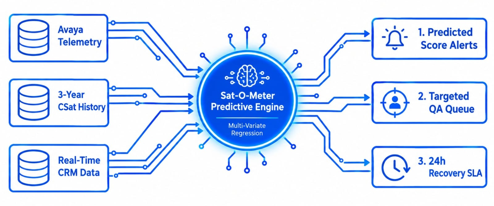
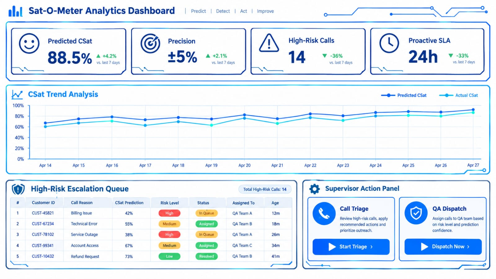

# 📊 Project 09: Sat-O-Meter — Predictive Customer Satisfaction (CSat) & Telemetry Analytics Engine

## Executive Overview:

* **Enterprise Context:** Dell Technologies (Customer Care & Business Operations)
* **Role:** Automation Engineering Lead & Operations Bridge
* **Core Value Delivered:** Engineered **Sat-O-Meter**, a statistical forecasting and telemetry analytics engine in MS Access/SQL. Combined Avaya call telemetry, 3-year historical CSat survey text scrubs, and real-time case attributes to forecast CSat scores weeks ahead of survey receipt, allowing proactive customer recovery and coaching.
* **Impact & Key Deliverables:**
  * **Predictive Precision:** Forecasted customer satisfaction scores within a $\pm 5\%$ accuracy window 1 to 5 weeks ahead of official survey delivery.
  * **Proactive Recovery:** Identified high-risk dissatisfied calls before survey dispatch, giving supervisors an immediate window to intervene and resolve customer escalations.
  * **Data Integration:** Unified three disparate data feeds into a centralised relational database model without altering core telephony systems.
* **Core Stack:** MS Access (Relational DB & GUI Engine), T-SQL, Avaya Telemetry Feeds, Multi-Variate Non-Linear Regression & ARIMAX Statistical Models.

---

## 1. Operational Challenge & Unpredictable Feedback Loops:

### Baseline Operational Friction:
Customer Satisfaction (CSat) surveys lagged operations by several weeks, creating severe blind spots for floor management:

* **Reactive Triage:** Team leads only discovered customer dissatisfaction weeks after the call occurred, making root-cause remediation and customer recovery impossible.
* **Data Disconnect:** Telemetry data (hold times, transfer rates, talk duration) lived in telephony logs, while customer survey text lived in external vendor databases.
* **Unfocused Quality Coaching:** Quality audits were selected randomly rather than targeted toward interactions with a high statistical probability of customer dissatisfaction.

---

## 2. Solution Architecture & Multi-Source Predictive Engine:
To bridge the feedback gap, **Sat-O-Meter** ingested three distinct operational streams into a statistical regression pipeline:

```text
┌────────────────────────────────────────────────────────────────────────────────────────┐
│                               MULTI-SOURCE DATA INGESTION                              │
│  ┌─────────────────────────┐   ┌───────────────────────────┐   ┌────────────────────┐  │
│  │ 1. Avaya Call Telemetry │   │ 2. 3-Year CSat History    │   │ 3. Real-Time Case  │  │
│  │ (Hold Time, Transfers)  │   │ (Scrubbed Reason Codes)   │   │ Attributes (CRM)   │  │
│  └────────────┬────────────┘   └─────────────┬─────────────┘   └─────────┬──────────┘  │
└───────────────┼──────────────────────────────┼───────────────────────────┼─────────────┘
                │                              │                           │
                └─────────────────────────────┬┴───────────────────────────┘
                                              ▼
┌────────────────────────────────────────────────────────────────────────────────────────┐
│                   SAT-O-METER PREDICTIVE ENGINE (MS ACCESS / SQL)                      │
├────────────────────────────────────────────────────────────────────────────────────────┤
│  • Multi-Variate Non-Linear Regression & ARIMAX Modelling                              │
│  • Automated Telemetry Weighting & Keyword Frequency Parsing                           │
│  • Predictive Score Calculation (CSat Probability Output)                              │
└─────────────────────────────────────────────┬──────────────────────────────────────────┘
                                              ▼
┌────────────────────────────────────────────────────────────────────────────────────────┐
│                       SUPERVISOR ACTION & RECOVERY DASHBOARD                           │
├────────────────────────────────────────────────────────────────────────────────────────┤
│ • Predicted Low Score Alerts  • Targeted QA Coaching Queue   • 24h SLA Customer Triage │
└────────────────────────────────────────────────────────────────────────────────────────┘

```


### Technical Component Breakdown:
1. **Avaya Telemetry Parser:** Ingested daily call metrics, evaluating hold times, transfer counts, call duration, and wrap-up times.
2. **Text-Scrubbed Historical Baseline:** Analysed 3 years of historical CSat feedback to establish statistical correlations between specific call characteristics and low CSat scores.
3. **Statistical Weighting Engine:** Applied multi-variate non-linear regression to assign risk scores to live cases based on operational friction indicators.

---

## 3. Measurable Business Results & Operational Impact:


| Performance Metric | 🛑 Baseline State (Pre-Sat-O-Meter) | 🎯 Post-Deployment State (Sat-O-Meter) | 💡 Strategic Value |
| --- | --- | --- | --- |
| **CSat Feedback Lag** | 2–4 weeks delay via vendor surveys | **1–5 weeks ahead of official survey arrival**<br> | Shifted operations from reactive reporting to proactive recovery |
| **Forecast Accuracy** | Zero predictive visibility | **$\pm 5\%$ Variance Window**<br> | Highly reliable operational indicator for floor management |
| **QA Audit Targeting** | Random 10% sampling | **Risk-Based Targeted Coaching** | Maximised supervisor coaching impact on troubled interactions |
| **Escalation Recovery** | Lost recovery opportunities | **Pre-Survey Customer Outreach** | Recovered high-risk customer relationships prior to score logging |

---

## 4. Key Competencies Demonstrated:
* **Predictive Operational Analytics:** Applying statistical regression and time-series modelling to operational telemetry.
* **Desktop Database Architecture:** Building complex relational databases, UI forms, and statistical engines in MS Access/SQL.
* **Proactive Quality Management:** Transforming quality assurance from an audit function into a predictive customer retention engine.

---
