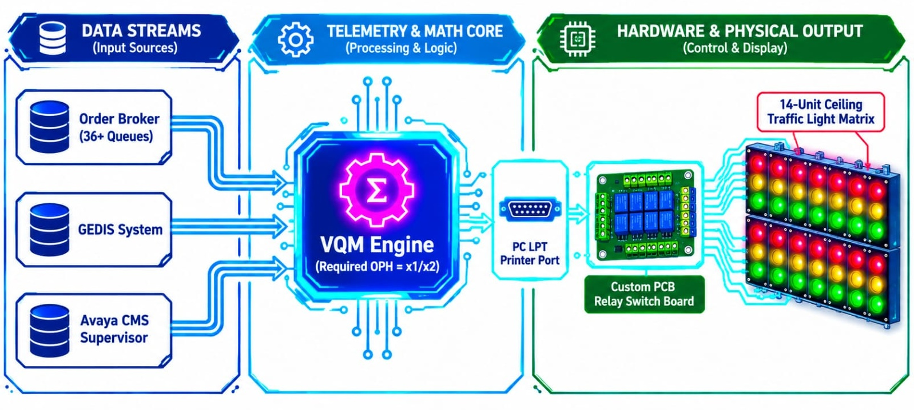
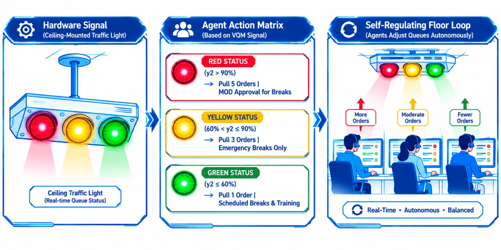

# 📊 Project 10: Visual Queue Manager (VQM) — Hardware-Integrated Automated Floor Telemetry & Physical Traffic Light Control Engine

## Executive Overview:

* **Enterprise Context:** Dell Technologies (EMEA Online Operations — DIS Hyderabad)
* **Role:** Operations Manager & End-to-End Systems Architect, Developer, Deployment & Maintenance Lead
* **Core Value Delivered:** Concepted, engineered, deployed, and maintained **Visual Queue Manager (VQM)** as a core Lean/Six Sigma floor control innovation. Designed an MS Access telemetry engine that calculated real-time queue capacity across **36+ Order Broker & GEDIS queues** ($18 \times 7$ operations) processing Dell.com web store sales orders. Combined 15-minute Avaya CMS supervisor reports and Order Broker feeds to output hardware signals via a PC parallel printer port to a custom PCB, dynamically controlling ceiling-mounted physical traffic lights (Red/Yellow/Green) across the floor.
* **Impact & Key Deliverables:**
  * **Lean Velocity Optimisation:** Enabled the floor to hit the 0-to-1 hour Velocity metric with zero backlog across 36+ regional queues.
  * **Mathematical Queue Thresholds:** Automated real-time Required OPH (Orders Per Hour) calculations ($y2 = x1/x2$) against target production baselines ($y1$), controlling agent batch-pulling behaviour (1, 3, or 5 orders at a time).
  * **Hardware-Driven Visual Control:** Architected and phased a 14-unit physical ceiling traffic light matrix across the floor, driving self-organizing agent break and work discipline.
  * **Frugal Innovation & High ROI:** Delivered enterprise-grade, floor-wide visual control using custom PCB relays and parallel-port triggers at a fraction of commercial display costs, executing a controlled 3-phase rollout from pilot to full 14-unit deployment.
  * **Enterprise Infrastructure & Governance:** Secured executive POC approvals, engineered an isolated power distribution system bypassing corporate UPS backups, and passed quarterly electrical, fire, and safety department audits.
* **Core Stack:** MS Access (Custom GUI & Logic Engine), Order Broker API/Staging, GEDIS, Avaya CMS Supervisor, LPT Parallel Port Hardware I/O, Custom PCB Relay Circuit, 230V Ceiling Light Matrix.

---

## 1. Operational Challenge & Floor Visibility Blindspots:

### Baseline Operational Friction:
EMEA Online Operations at Dell DIS Hyderabad processed sales orders placed across EMEA web stores, requiring continuous $18 \times 7$ queue monitoring:

* **36+ Fragmented Order Queues:** Orders flowed into 36+ distinct regional queues within **Order Broker**, making manual tracking across queues inefficient and error-prone.
* **Strict Velocity Metrics:** The floor operated under a strict **0 to 1-hour Velocity SLA**, where unhandled order fallout quickly turned into delivery delays.
* **Manual Headcount & Queue Inspections:** Team leads spent significant shift time manually checking individual Order Broker queue volumes and walking the floor to count active agents.
* **Uncoordinated Break Disruptions:** Without a shared visual queue status, agents took breaks or attended meetings during unexpected order volume surges, causing severe backlog accumulation.

---

## 2. Solution Architecture, Mathematical Logic & Hardware Integration:
As both the Operations Manager facing floor friction and the hands-on hardware/software developer, designed a full-stack telemetry pipeline connecting live software feeds to physical ceiling lights:

```text
┌────────────────────────────────────────────────────────────────────────────────────────┐
│                        DATA INGESTION & LEAN CAPACITY FEEDS                            │
│  ┌─────────────────────────┐   ┌───────────────────────────┐   ┌────────────────────┐  │
│  │ 1. Order Broker         │   │ 2. GEDIS Sales Order      │   │ 3. Avaya CMS       │  │
│  │    (36+ Queues x1)      │   │    System                 │   │    Supervisor (x2) │  │
│  └────────────┬────────────┘   └─────────────┬─────────────┘   └─────────┬──────────┘  │
└───────────────┼──────────────────────────────┼───────────────────────────┼─────────────┘
                │                              │                           │
                └─────────────────────────────┬┴───────────────────────────┘
                                              ▼
┌────────────────────────────────────────────────────────────────────────────────────────┐
│                  VQM TELEMETRY & REQUIRED OPH ENGINE (MS ACCESS / T-SQL)               │
├────────────────────────────────────────────────────────────────────────────────────────┤
│  • Required OPH Calculation: y2 = x1 / x2 (Orders Available / Agents Available)        │
│  • Threshold Evaluator against Target OPH (y1)                                         │
│  • Parallel Port (LPT) Signal Generator Output Driver                                  │
└─────────────────────────────────────────────┬──────────────────────────────────────────┘
                                              │ (LPT Hardware Signal)
                                              ▼
┌────────────────────────────────────────────────────────────────────────────────────────┐
│                  HARDWARE INTERFACE & ISOLATED POWER INFRASTRUCTURE                    │
├────────────────────────────────────────────────────────────────────────────────────────┤
│  • Custom Printed Circuit Board (PCB) with Relay Switches                              │
│  • Isolated Dedicated Power Cabling (Bypassing Main Enterprise UPS System)             │
│  • 14-Unit Floor Traffic Light Matrix (Physical 230V Red / Yellow / Green Bulbs)       │
└────────────────────────────────────────────────────────────────────────────────────────┘

```


### Technical, Mathematical & Hardware Governance Breakdown:

1. **Mathematical Queue Capacity Engine:**
Programmed an MS Access engine evaluating real-time operational capacity using the formula:

$$\text{Required OPH } (y2) = \frac{\text{Orders Available } (x1)}{\text{Agents Available on Floor } (x2)}$$

The required OPH ($y2$) was continuously evaluated against the Target OPH ($y1$, maximum orders an agent can process per hour) to calculate the probability of clearing the queue within 1 hour.

2. **Automated Traffic Light Logic & Agent Rules:**
* 🔴 **RED LIGHT ($y2 > 90\%$ of Target OPH):** High order volume backlog. Agents pull **5 orders at a time** from Order Broker. Personal breaks require Manager On Duty (MOD) approval.
* 🟡 **YELLOW LIGHT ($60\% < y2 \le 90\%$ of Target OPH):** Medium volume. Agents pull **3 orders at a time** (MOD approval). Only emergency and dinner breaks permitted.
* 🟢 **GREEN LIGHT ($y2 \le 60\%$ of Target OPH):** Normal state. Agents pull **1 order at a time**. Scheduled breaks, coaching, and offline training cleared.

3. **Printer Port Hardware & PCB Architecture:**
Coded low-level I/O routines sending bitwise signals through the PC parallel printer port (LPT) directly to a custom-fabricated PCB relay board.

4. **Phased Scale & Infrastructure Safety:**
* Scaled the hardware footprint via a structured 3-phase deployment from initial pilot to 14 light units across all regional workgroups.
* Architected dedicated power wiring for the light matrix that strictly bypassed main enterprise UPS backups to protect core server infrastructure, backed by mandatory quarterly electrical, fire, and safety department certifications.

---

## 3. The 3 Core Visual Control Modules of VQM:



### Module 1: Order Broker & Avaya Live Telemetry Engine
* **Features:** Ingests live order counts across 36+ Order Broker queues and active agent states from Avaya CMS, executing 1-hour queue clearance calculations every 15 minutes.
* **Impact:** Replaces manual queue inspections with automated, mathematically verified capacity metrics.

### Module 2: Hardware Printer Port PCB Relay Controller
* **Features:** Converts software threshold states into physical electrical signals via LPT port to trigger high-voltage PCB relays.
* **Impact:** Bridges software analytics to physical ceiling-mounted light arrays across the operational floor.

### Module 3: Self-Organizing Agent Discipline Framework
* **Features:** Prominent 14-unit physical Red/Yellow/Green light matrix visible to all floor agents.
* **Impact:** Drives autonomous behavioral compliance—agents instantly know whether to pull 1, 3, or 5 orders, delay breaks, or take training without manager intervention.

---

## 4. Measurable Business Results & Operational Impact:

| Performance Metric | 🛑 Baseline State (Pre-VQM) | 🎯 Post-Deployment State (VQM Engine) | 💡 Strategic Value |
| --- | --- | --- | --- |
| **Queue Velocity SLA** | Frequent backlog spikes across 36+ queues | **0-to-1 Hour Velocity Standard Consistently Met**<br> | Guaranteed zero backlog across all EMEA Online queues |
| **Floor Discipline Signal** | Manual management announcements for breaks | **Physical PCB-Driven Traffic Light Matrix (14 Units)**<br> | Floor self-organizes order batching (1, 3, or 5) and breaks based on lights |
| **Capacity Calculation** | Manual queue checks & physical headcounts | **Automated $y2 = x1/x2$ Required OPH Engine**<br> | Mathematically precise capacity management via Avaya/ Order Broker feeds |
| **Infrastructure Safety** | Unapproved desktop add-ons | **Isolated Power Grid & Quarterly Fire/Safety Audits** | 100% compliance with corporate electrical and safety standards |

---

## 5. Key Competencies Demonstrated:

* **Lean/Six Sigma Process Engineering:** Applying visual management principles to software-driven operational workflows.
* **Full-Stack Systems & Hardware Engineering:** Combining software analytics (MS Access/T-SQL), mathematical logic, and low-level hardware integration (LPT port to custom PCB relays).
* **Cross-Functional Governance & Frugal Innovation:** Securing executive approvals, executing a phased deployment, and maintaining quarterly electrical/fire safety audit sign-offs while delivering high-impact solutions with minimal CapEx.

---
