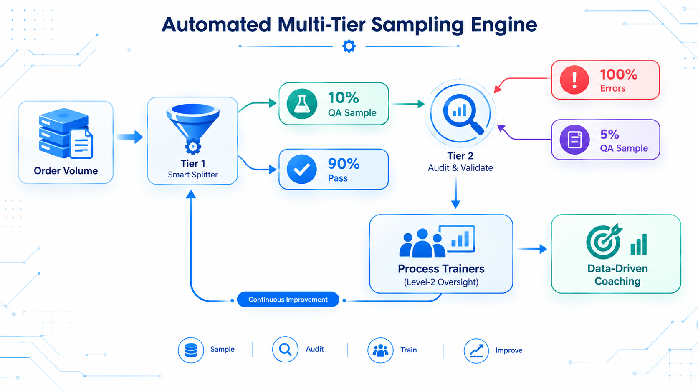
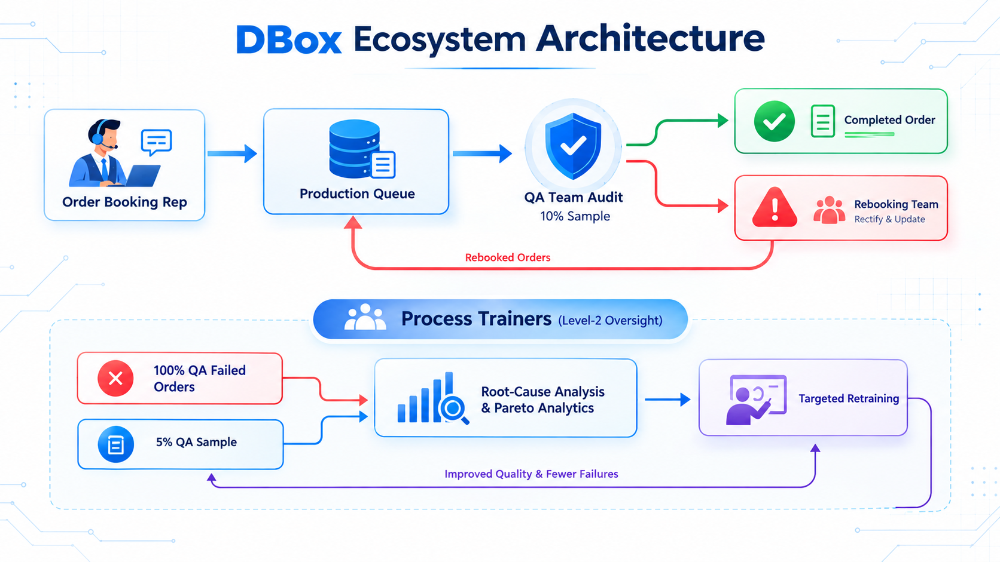
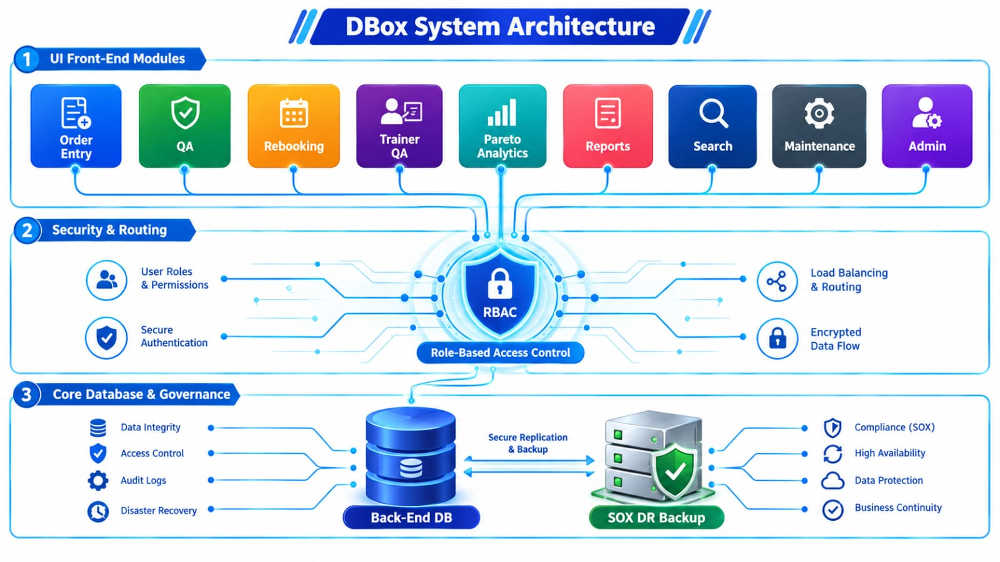
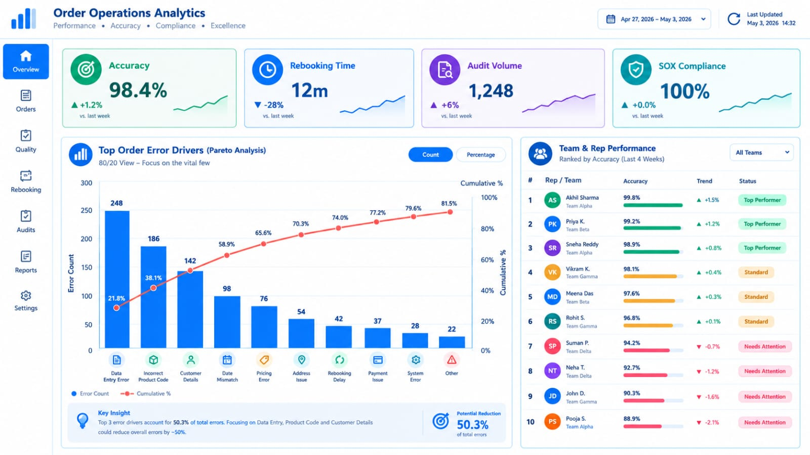

# Project 11: DBox (Data Box) — Operations & Quality Assurance Management Platform:

## Executive Overview:

* **Enterprise Context:** Developed as an end-to-end operational ecosystem for the EMEA EBox team to manage, audit, rebook, and govern the online order processing lifecycle.
* **Role:** Operations Manager & End-to-End Systems Architect, Developer, Deployment & Maintenance Lead
* **Core Value Delivered:** Engineered an agile, closed-loop MS Access ecosystem that integrated online order entry, multi-tier QA and rebooking workflows, automated sampling, and advanced Pareto root-cause analytics into a single unified architecture.
* **Impact & Key Deliverables:**
  * Architecturalized and deployed an agile, end-to-end MS Access ecosystem featuring specialised operational interfaces (Order Entry, QA, Rebooking, Trainer Audit, Search, Admin, Maintenance) and real-time leadership analytics dashboards.
  * Designed and coded a multi-tier closed-loop feedback engine that automates 10% stratified sampling for QA, 100% error-routing to Rebooking and Process Trainers, and 5% Level-2 "QA of QA" audits to power precision retraining.
  * Enforced enterprise-grade data governance, role-based access security, and continuous SOX compliance through scheduled background utilities and audit-ready reporting.
* **Core Stack:** MS Access (Split Architecture), VBA, DAO, SQL, Windows Task Scheduler/ Background Utilities, Stratified Sampling Algorithms.

---

### 1. Baseline Operational Friction:

* **Fragmented Online Order Lifecycle:** Online order booking, QA audits, and rebooking workflows were managed across isolated spreadsheets and manual handoffs, causing delays and lack of end-to-end visibility.
* **Subjective QA & Untracked Rebooking:** Quality Assurance relied on non-standard manual sampling routines, while rebooked order errors lacked a systemic mechanism to route back into the primary QA cycle for re-auditing.
* **Absence of QA Oversight & Closed-Loop Training:** Process trainers lacked a systematic framework to conduct "QA of QA" audits, preventing root-cause tracking and relying on generic training instead of data-driven recaps.
* **Data Governance & SOX Audit Risks:** Manual database practices and fragmented access controls exposed the operation to security risks, data loss, and potential Sarbanes-Oxley (SOX) audit non-compliance.

---

### 2. Solution Architecture & Technical Workflow:

#### 2.1 Complete End-to-End Ecosystem Process Cycle:
* **Online Order Entry:** Online Order Processing Reps capture and submit order entries via dedicated system forms into the central production queue.
* **Tier-1 QA Audit:** The system automatically selects and routes a **10% stratified sample** of rep productivity to the QA team for auditing.
* **Rebooking & QA Re-entry Loop:** Any order failing QA is automatically directed to the Rebooking team for rectification. Once rebooked, the order is pushed back into the online production queue and re-enters the QA audit cycle.
* **Level-2 Trainer Audits (QA of QA):** Process Trainers perform 100% audit checks on all QA-identified errors while simultaneously conducting a **5% sample audit** on general QA team entries ("QA of QA").
<!-- Placement: Section 2.1 - Multi-Tier QA Sampling Framework -->

* **Closed-Loop Retraining:** Process Trainers utilise error findings from Level-2 audits and Rebooking trends to drive targeted retraining and reinforce critical process updates.

```text

+-----------------------------------------------------------------------------------+
|                     DBOX END-TO-END PROCESS & AUDIT ECOSYSTEM                     |
+-----------------------------------------------------------------------------------+

+--------------------------+    Order Entry    +------------------------------------+
| Online Order Booking Rep | ----------------> |          Production Queue          |
+--------------------------+                   +------------------------------------+
                                                                 |
                                                      (10% Stratified Sample)
                                                                 |
                                                                 v
                                               +------------------------------------+
                                               |           QA Team Audit            |
                                               +------------------------------------+
                                                                 |
                                   +-----------------------------+----------+
                                   |                                        |
                            (Passed Audit)                            Failed Audit)
                                   |                                        |
                                   v                                        v
                  +----------------+---+               +--------------------+------+
                  |   Completed Order  |               |      Rebooking Team       |
                  +--------------------+               +---------------------------+
                                                                    |
                                                         (Rectifies & Re-issues)
                                                                    |
                                                                    v
                                                       +---------------------------+
                                                       |  Re-enters Production Q   |
                                                       +---------------------------+
                                                                    |
                                      +-----------------------------+
                                      |
                                      v
+-----------------------------------------------------------------------------------+
|         PROCESS TRAINERS (LEVEL-2 OVERSIGHT & CLOSED-LOOP RETRAINING)             |
+-----------------------------------------------------------------------------------+
|                                                                                   |
|  +--------------------------+                                                     |
|  | 100% of QA Failed Orders |---+                                                 |
|  +--------------------------+   |   +------------------------------------------+  |
|                                 +-->| Root-Cause Analysis & Error Diagnostics  |  |
|  +--------------------------+   |   |        "QA of QA" Accuracy Check         |  |
|  |  5% Sample of QA Audits  |---+   +------------------------------------------+  |
|  +--------------------------+                            |                        |
|                                                          v                        |
|                                         +----------------------------------+      |
|                                         |  Retraining & Pareto Analytics   |      |
|                                         +----------------------------------+      |
+-----------------------------------------------------------------------------------+

```
<!-- Placement: Section 2.1 - Complete End-to-End Ecosystem Process Cycle -->


#### 2.2 Agile UI & System Module Architecture:
Built using a robust split-database model (1 central back-end DB connected to a modular VBA/ DAO front-end), the system was iteratively engineered in an agile mode based on continuous user feedback across nine core modules:

<!-- Placement: Section 2.2 - Agile UI & System Module Architecture -->


* **Order Entry Form:** Primary workspace for Online Order Booking Reps to process incoming orders.
* **Order Search Form:** Centralised lookup tool for tracking general order status, history, and details.
* **QA Form:** Dedicated interface for the QA team to execute Tier-1 productivity audits.
* **Rebooking Form:** Specialised queue for the Rebooking team to rectify and re-issue failed order entries.
* **Process Trainer QA Form:** Dual-purpose interface for trainers to perform Level-2 audits on QA team output and Rebooking productivity.
* **Analytics Engine:** Dynamic dashboards providing error analysis, root-causing, and Pareto charts for trainers, managers, and leadership.
* **Reporting Engine:** Operational reporting tracking productivity metrics for Reps, QA, Rebooking, Trainers, and Managers.
* **Database Maintenance Form:** Maintenance interface for automated background tasks, index optimisation, and scheduled network backups.
* **Admin Access Manager:** Security and governance module for maintaining user access rights, role definitions, and system permissions.

---

### 3. Key Metrics & Business Impact:

| 📊 Metric / KPI | ⏳ Before | 🚀 After / Impact |
| --- | --- | --- |
| **Workflow Ecosystem Integration** | Disconnected / Manual | **100% Closed-Loop (Entry ➔ QA ➔ Rebooking ➔ Retraining)** |
| **QA Sampling Neutrality** | Manual / Subjective | **10% Stratified Algorithmic Routing (0% Bias)** |
| **Error Feedback & Oversight** | Ad-hoc / Untracked | **100% QA Error Routing + 5% Trainer "QA of QA"** |
| **System Security & Compliance** | Unstructured Access | **Role-Based Admin Control & 100% SOX Compliant Backups** |

---

### 4. Measurable Business Results & Operational Impact:

<!-- Placement: Section 3 / Section 4 - Analytics & Business Results -->


* **Unified Operational Lifecycle:** Successfully transformed disparate order booking, auditing, and rebooking routines into a single, seamless MS Access ecosystem.
* **Closed-Loop Quality Governance:** Established complete end-to-end quality assurance by ensuring all failed orders were rebooked, re-audited, and analysed by trainers for root cause.
* **Data-Driven Process Optimisation:** Enabled leadership and trainers to leverage Pareto analytics and root-cause dashboards, converting audit findings directly into targeted retraining programs.
* **User-Centric Agile Deployment:** Delivered a highly adopted platform built iteratively around real user feedback across every operational persona (Reps, QA, Rebooking, Trainers, Leadership).

---

### 5. Key Competencies Demonstrated:

* **End-to-End System Architecture:** Full-lifecycle development of split-database architectures using MS Access, VBA, DAO, and SQL.
* **Agile Product Delivery:** User-centric iterative development, rapid prototyping, feedback incorporation, and multi-interface deployment.
* **Quality Assurance & Process Design:** Closed-loop quality control loops, stratified sampling implementation, and Level-2 oversight architecture.
* **Operational Analytics & Governance:** Pareto analysis, cross-functional productivity reporting, role-based access security, and SOX compliant maintenance scheduling.


---
