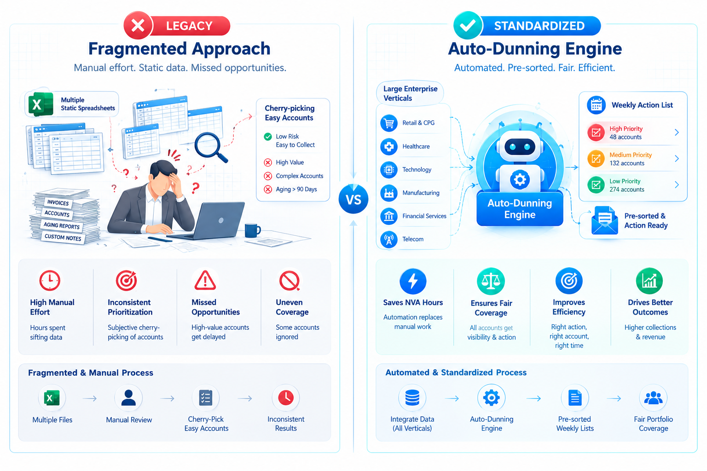
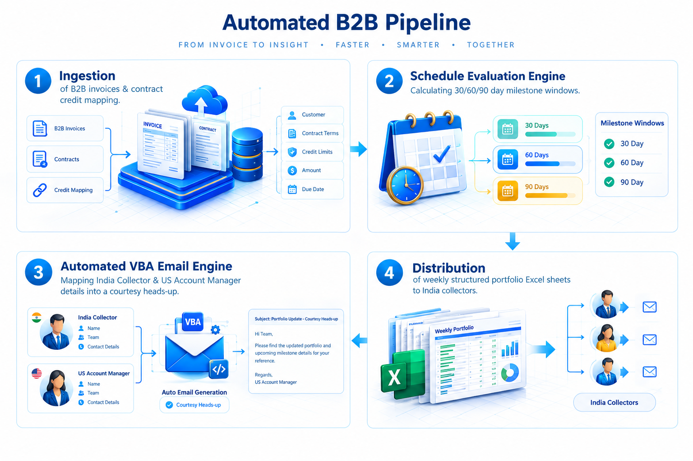
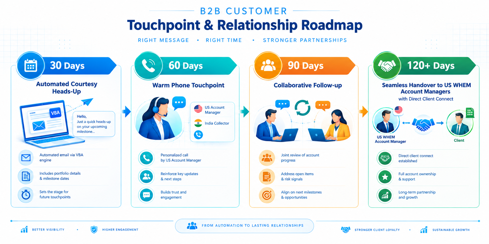
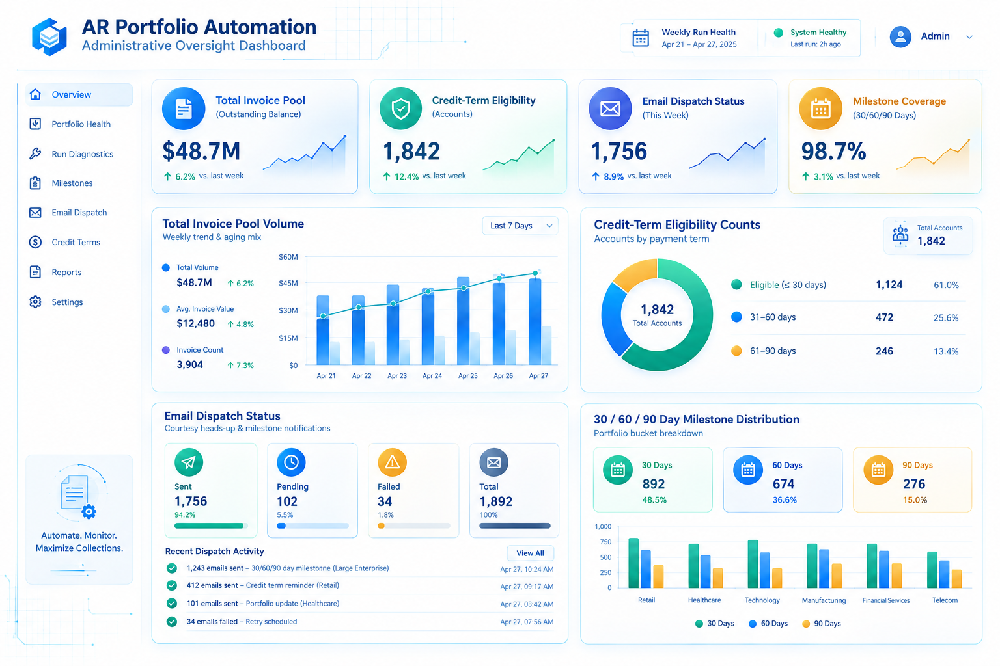

# 📊 Project 14: Auto-Dunning Engine — Automated B2B Accounts Receivable Portfolio Alignment & Nudge Engine

## Executive Overview:

* **Enterprise Context:** Dell Technologies — Global Financial Services (GFS), World Wide Enterprise Management (WHEM) B2B Invoice Taxation & AR Operations
* **Role:** Senior Operations Manager & End-to-End Automation Lead
* **The Strategic Objective:** Standardise and automate the B2B portfolio dunning and outreach workflow across Large Enterprise (LE) verticals. The system needed to systematically evaluate multi-tiered credit terms, send courteous payment schedule summaries to enterprise B2B clients, and provide Dell India GFS collection agents with ready-made, prioritised weekly action sheets to eliminate manual non-value-added (NVA) preparation work.
* **The Big Problem:** Collection agents and Team Leads previously spent significant NVA hours every month manually building account lists from static sheets. Each LE team had its own ad-hoc approach—often picking "low-hanging fruit" regular customers to hit immediate targets, while complex or challenging overdue accounts were repeatedly deferred.
* **The Solution:** Engineered the **Auto-Dunning Engine** in MS Access, SQL, and VBA. Executed on a weekly schedule, the tool automatically ingests open invoice data, evaluates contract-specific credit limits, sends personalised courtesy nudges to B2B clients one week prior to 30/60/90-day milestones (with mapped collector and US Account Manager contact details), and delivers weekly prioritised portfolio summaries directly to local India collectors and Team Leads via Excel.
* **Core Value Delivered:**
  * **100% Process Standardisation Across LE Verticals:** Replaced fragmented, team-specific collection approaches with a unified, objective portfolio alignment methodology across all enterprise accounts.
  * **Elimination of NVA Prep Time:** Saved hundreds of agent/lead hours monthly by auto-generating ready-to-use weekly portfolio lists right at month-start, allowing collectors to focus entirely on relationship-building and actual debt recovery.
  * **Seamless B2B Relationship Preservation:** Replaced aggressive dunning with respectful, tailored payment heads-up, maintaining warm client connections and enabling a structured handover to US GFS Account Managers for accounts reaching 120+ days.
* **Tools & Stack:** MS Access (Relational DB & Admin Engine), SQL (Ageing Queries & Dynamic Portfolio Grouping), VBA (Outlook Mailer Integration & Employee DB Mapping), MS Excel (Weekly Collector & Manager Roll-ups).

---

## 1. Operational Problem & Business Impact:
In the B2B Large Enterprise (LE) segment, customer accounts carry substantial credit lines and long-term strategic value. Prior to the Auto-Dunning Engine, operational friction stemmed from manual allocation and inconsistent approaches:



1. **High NVA Overhead:** Collectors and Team Leads spent valuable time at the start of every month manually pulling, sorting, and cleaning invoice reports to determine whom to contact.
2. **Inconsistent Collection Strategies:** Each LE vertical operated independently. Agents frequently prioritised "easy" accounts or regular paying clients to meet short-term targets, pushing complex or difficult balances down the line.
3. **Risk of Relationship Degradation:** Uncoordinated or overly frequent outreach risked burning bridges with sensitive enterprise clients. Outreach required an extremely respectful tone, recognising that over 40% of B2B clients pay automatically and others merely require a timely courtesy notice.

---

## 2. System Architecture & Dunning Logic:
The Auto-Dunning Engine operates as a centralised, weekly dunning process in MS Access:



```text
┌──────────────────────────────────────────────┐     ┌──────────────────────────────────────────────┐
│  1. Ingestion & Contract Credit Mapping      │     │  2. Ageing & Schedule Evaluation Engine      │
│ Pull open B2B invoices & map client-specific │ ──> │ Calculate 30/ 60/ 90 day milestone windows   │
│ contract credit terms (not all get 30/60/90).│     │ and flag one-week advance nudge dates.       │
└──────────────────────────────────────────────┘     └──────────────────────┬───────────────────────┘
                                   ┌────────────────────────────────────────┘
                                   ▼
┌──────────────────────────────────────────────┐     ┌──────────────────────────────────────────────┐
│  3. Personalised Nudge & Employee Mapping    │     │ 4. Weekly Collector & Lead Portfolio Delivery│
│ Auto-populate client email with invoice list │ ──> │ Generate & distribute structured Excel sheets│
│ and map India Collector & US Account Manager.│     │ to India GFS collector, Team Lead & Manager. │
└──────────────────────────────────────────────┘     └──────────────────────────────────────────────┘

```

### B2B Portfolio Touchpoint & Escalation Matrix:

*Note: All notices are framed as polite payment schedule summaries (Heads-up), never aggressive demands or reminder letters. B2B clients receive no payment links as standard corporate payment channels are already established.*



| Milestone Window | Client Communication Trigger (1 Week Prior) | India GFS Collector Role | US GFS Account Manager Role |
| --- | --- | --- | --- |
| **30 Days** | Automated Courtesy Heads-up Email | System-driven tracking; no manual call required. | Mapped on email footer for transparency. |
| **60 Days** | Automated Courtesy Heads-up Email | Warm phone touchpoint to review invoice schedule & resolve roadblocks. | Mapped on email footer; kept informed on account status. |
| **90 Days** | Automated Courtesy Heads-up Email | Active collaborative follow-up with client AP team. | Direct alignment with India collector for personal touch. |
| **120+ Days** | Portfolio Handover to WHEM SM/ US GFS | Handover documentation & background history provided to US team. | **Direct Personal Connect:** Account Managers engage client counterparts (including on-site client visits in US). |

---

## 3. Operational Modules:

* **Module 1: Contract-Aware Ageing & Ingestion Engine:** Standardises open invoice feeds, dynamically applying contract-specific credit limits rather than generic static rules.
* **Module 2: Mapped Communication & Outlook VBA Engine:** Integrates MS Access with Outlook via VBA to auto-generate personalised B2B Heads-up emails. It dynamically queries the internal employee database to attach the exact names and contact details of the assigned **India GFS Collector** and **US WHEM Account Manager** in the signature block for seamless client alignment.
* **Module 3: Weekly Automated Workload Allocator:** Replaces manual daily spreadsheet filtering. Every week, the dunning engine auto-populates clean, pre-sorted Excel portfolio lists for India collection agents and Team Leads, eliminating NVA prep work at month-start.
* **Module 4: Admin Oversight & System Health Summary:** An administrative panel within MS Access (managed solely by the End-to-End Automation Lead) providing weekly diagnostic reports on total invoice pool volume, eligibility counts, email dispatch logs, and milestone bucket distribution.


---

## 4. Measurable Business Results & Operational Impact:



| Operational Dimension | 🛑 Legacy Manual Process | 🎯 Auto-Dunning Engine | 💡 Operational Impact |
| --- | --- | --- | --- |
| **Portfolio Allocation & Fairness** | Manual, team-specific sorting; "low-hanging fruit" prioritised | **Standardised, automated portfolio distribution across all LE verticals** | Objective coverage of all ageing accounts without cherry-picking. |
| **Agent NVA Time** | High manual prep time building lists at month-start | **Zero prep time; ready-made weekly Excel lists delivered automatically** | Agents focus 100% of their bandwidth on active collection & client relationships. |
| **Client Relationship Management** | Risk of erratic, uncoordinated agent outreach | **Structured, respectful Heads-Up + 120-day US Account Manager connection** | Preserves high-value B2B relationships while maintaining steady cash flow. |
| **Contact Transparency** | Inconsistent contact details shared with clients | **Automated mapping of India Collector & US Account Manager names** | Clear internal alignment and seamless escalation path for enterprise clients. |
| **Leadership & Floor Experience** | Time wasted on manual tracking & floor friction | **Positive floor feedback; leadership freed from operational NVA tasks** | Management focus redirected from spreadsheet tracking to strategic operations. |

---

## 5. Key Competencies Demonstrated:

* **B2B Financial Operations & Enterprise AR:** Managing complex Large Enterprise (LE) accounts, B2B contract credit lines, and invoice taxation workflows in GFS.
* **End-to-End Database & Mail Automation:** Architecture in MS Access, SQL, and VBA integrating Outlook mailers and employee database cross-referencing.
* **Strategic Process Standardised:** Harmonising disparate, team-specific operational methods into a single enterprise-grade workflow.
* **Cross-Border Leadership & Collaboration:** Orchestrating seamless operational handovers between Dell India GFS collectors and US WHEM Account Managers.


---
