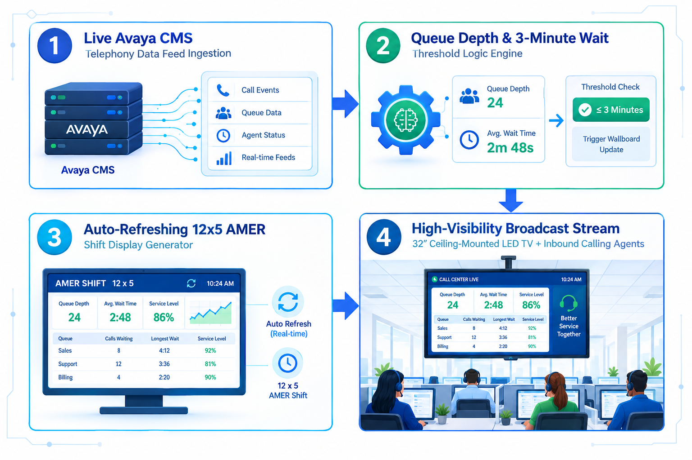
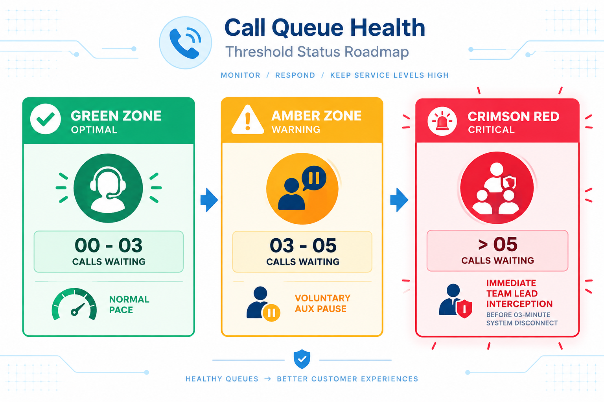
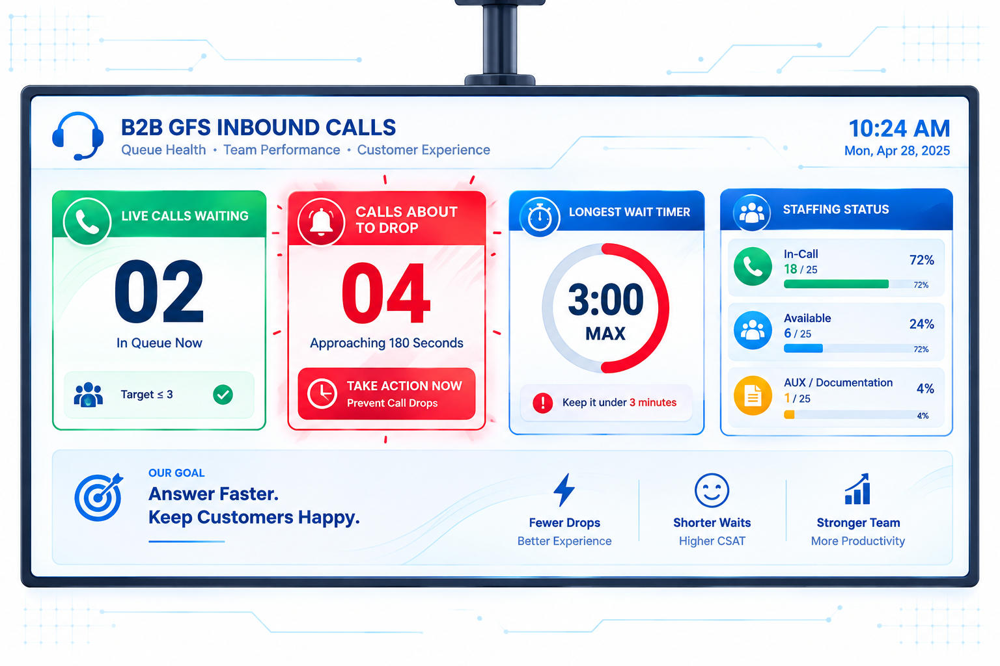
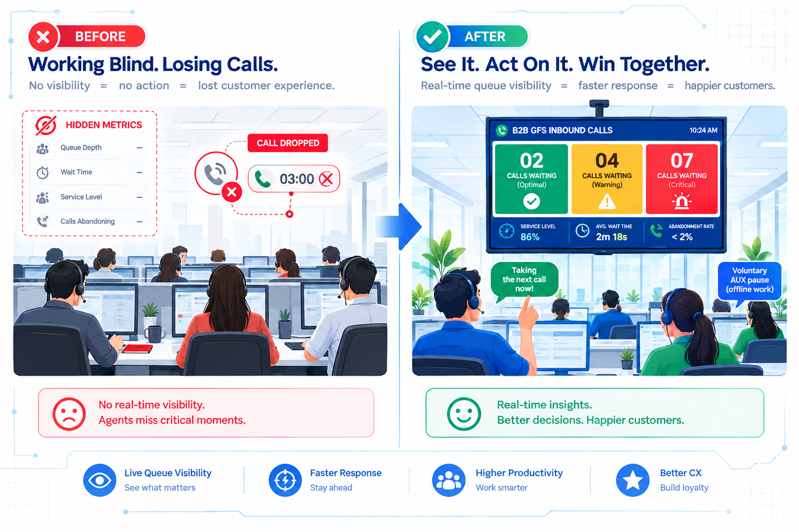

# 🖥️ Project 15: Q-Vision Wallboard — Real-Time Inbound Telephony & Intra-day Queue Health Engine

## Executive Overview:

* **Enterprise Context:** Dell Technologies — Global Financial Services (GFS WHEM/AMER) B2B Invoice Taxation & AR Operations
* **Role:** Senior Operations Manager & End-to-End Automation Lead
* **The Strategic Objective:** Build a lightweight, real-time telephony wall-board engine to broadcast live Avaya call queue metrics, waiting times, agent AUX states, and critical 3-minute drop thresholds onto 32-inch ceiling-mounted LED TV screens across the India floor operating during US AMER business hours. The objective was to eliminate B2B call drops caused by hidden queue data and drive organic floor self-regulation without complex data storage or high-cost software.
* **The Big Problem:** 
  * **Automated 3-Minute System Disconnects:** Inbound calls from US B2B enterprise clients — spanning past-due balance enquiries, tax exemption updates, credit holds, and payment portal issues — were automatically dropped by telephony configuration whenever wait times reached 180 seconds.
  * **Opted-Out Real-Time WFM Coverage:** To reduce per-agent overhead costs during Service Agreement transitions, as a general practise, smaller specialised queues opted out of central WFM support. Consequently, central Global and Site WFM teams directed all real-time inbound calling queue support/ tracking toward high-volume and critical to business queues like Sales, Tech Support, Customer Care, Dell Financial Services (DFS), leaving the 12-person WHEM AR team with zero dedicated WFM monitoring.
  * **Siloed Telephony Visibility:** Live Avaya CMS queue depth and waiting metrics were restricted exclusively to supervisor desktop screens, keeping frontline agents entirely blind to incoming call surges.
  * **Uncoordinated Floor AUX States:** Without real-time WFM oversight or shared queue visibility, agent breaks and offline documentation AUX states occurred in an uncoordinated manner, triggering artificial staffing deficits and system-driven call disconnects during peak US business hours.
* **The Solution:** Leveraged strong cross-functional relationships across site teams to execute a zero-cost, weekend deployment. Identified a forgotten & un-utilized 32-inch LED TV on site, secured the necessary approvals, and coordinated with facilities to relocate and remount it directly above the WHEM AR inbound team calling floor. Worked with site technology to power it up and run display cables to a dedicated desktop executing a continuous 12x5 MS Access/ VBA rendering loop mapped to the WHEM/ AMER shift.
* **Core Value Delivered:**
  * **Zero Call Drops Beyond 3 Minutes:** Provided clear visual countdowns for waiting calls, allowing agents and leads to intercede well before the 3-minute threshold was breached.
  * **Floor Self-Regulation:** Empowered frontline agents to see live queue depth and AUX states, prompting them to voluntarily pause non-critical documentation, breaks or client outbound call-backs, during sudden call surges.
  * **Rapid Weekend Deployment:** Delivered 100% floor visibility in a single weekend using existing floor hardware and zero capital expenditure, avoiding unnecessary complexity or historical trend over-engineering.
* **Tools & Stack:** Real-Time Avaya CMS Data Feed Ingestion, MS Access/ VBA Display Engine, SQL Logic Processing, 32-Inch Ceiling-Mounted LED TV Hardware Integration.

---

## 1. Operational Problem & Business Impact:

In the GFS WHEM B2B segment, inbound calls are generated when enterprise clients receive dunning schedule summaries. Call drivers include:
* Enquiries on 30/60/90-day past-due balances
* Tax exemption certificate updates & invoice recalculations
* Clarifications on payment portal routing & wire transfers
* Disputed line items or pending credit memos

**Prior to Q-Vision**, operational vulnerabilities included:
1. **Hidden Telephony Data:** Live queue depth was locked inside supervisor Avaya desktop windows, leaving agents completely blind to mounting waiting calls.
2. **Uncoordinated AUX & Break States:** Agents entering AUX states for offline documentation or taking scheduled breaks during unexpected inbound volume spikes caused artificial staffing shortages.
3. **Automated Telephony Drop Thresholds:** The Avaya system was configured to automatically disconnect calls waiting past the 3-minute mark, resulting in severe B2B customer friction and negative inputs from Global WFM during monthly global performance reviews.

---

## 2. System Architecture & Intra-day Flow:
The Q-Vision Wall-board functions as a direct, zero-storage pass-through display loop running 12x5:



```text
┌──────────────────────────────────────────────┐     ┌──────────────────────────────────────────────┐
│  1. Real-Time Avaya Data Feed Ingestion      │     │  2. Queue Depth & 3-Min Threshold Logic      │
│ Stream live inbound call counts, wait times, │ ──> │ Evaluate waiting seconds against 3-min drop  │
│ and active agent AUX/ documentation states.  │     │ limits; trigger colour-coded visual alerts.  │
└──────────────────────────────────────────────┘     └──────────────────────┬───────────────────────┘
                                   ┌────────────────────────────────────────┘
                                   ▼
┌──────────────────────────────────────────────┐     ┌──────────────────────────────────────────────┐
│  3. Auto-Refreshing Visual Render (AMER 12x5)│     │  4. 32" Ceiling LED Display & Self-Regulation│
│ Format high-contrast visual KPI blocks,      │ ──> │ Broadcast live metrics to overhead TV for    │
│ waiting call timers, and staffing counters.  │     │ instant floor-wide self-regulation.          │
└──────────────────────────────────────────────┘     └──────────────────────────────────────────────┘

```

### Intra-day Threshold & Response Matrix:

|🚦Queue & Wait State | ⏱️Avaya Wait Timer | 📺Display Visual Indicator | 🚨Floor Action & Self-Regulation Trigger |
| --- | --- | --- | --- |
| **Optimal** | 00-03 Calls Waiting | Wait < 60s | **Solid Emerald Green** | Normal floor pace; documentation & scheduled breaks proceed as planned. |
| **Warning** | 03-05 Calls Waiting | Wait 60s-120s | **Vibrant Amber Yellow** | Agents voluntarily wrap up AUX documentation and defer non-urgent breaks. |
| **Critical** | Calls Waiting > 05 | Wait > 120s | **Flashing Crimson Red** | **Immediate Intervention:** Leads & available agents take immediate calls before 3-min drop. |



---

## 3. Operational Modules:

* **Module 1: Real-Time Avaya Telephony Connector:** Ingests live operational queue streams directly from Avaya CMS without saving or storing historical records, keeping the process lightweight and fast.
* **Module 2: 3-Minute Call Drop Guard Engine:** Monitors the exact wait duration of every incoming call, triggering high-visibility alerts as calls approach the critical 180-second drop boundary.
* **Module 3: Staffing & AUX State Tracker:** Displays real-time counts of agents currently **In-Call**, **Available**, or in **AUX (Documentation/ Break)**, encouraging floor-wide accountability.
* **Module 4: High-Visibility 32-Inch TV UI Renderer:** A clean, high-contrast user interface engineered specifically for long-distance legibility across 32-inch ceiling-mounted LED screens.



---

## 4. Measurable Business Results & Operational Impact:

| ⚙️Operational Dimension | 🚨 Legacy Hidden Avaya Model | 💡 Q-Vision Wallboard Engine | ⚡ Operational Impact |
| --- | --- | --- | --- |
| **Queue Visibility** | Metrics hidden inside Team Lead Avaya screens | **100% Floor Transparency via 32" Overhead LED TV** | Universal awareness across all collectors, leads, and floor managers. |
| **Call Drop Prevention** | High call drops after 3-minute wait mark | **Zero 3-minute call drops via proactive visual alerts** | Protected B2B customer relationships and eliminated Global WFM review escalations. |
| **AUX & Break Management** | Uncoordinated breaks causing staffing deficits | **Organic floor self-regulation during volume spikes** | Agents voluntarily pause documentation AUX states the moment yellow/red alerts appear. |
| **Implementation Speed** | Months of WFM reviews and manual reporting | **Turned around in 1 weekend using existing floor hardware** | Zero CapEx; desktop display connection running a lightweight 12x5 render loop. |



---

## 5. Key Competencies Demonstrated:

* **Intra-Day Operations & B2B Telephony Management:** Real-time queue monitoring, Avaya CMS tracking, and 3-minute call drop prevention.
* **Rapid Hardware & Automation Deployment:** Single-weekend turnaround connecting existing 32" LED displays to automated MS Access rendering engines.
* **Visual Management & Nudge Psychology:** Designing simple visual cues that drive frontline self-regulation without supervisory friction.

---
